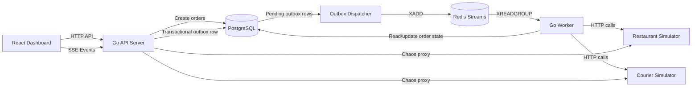
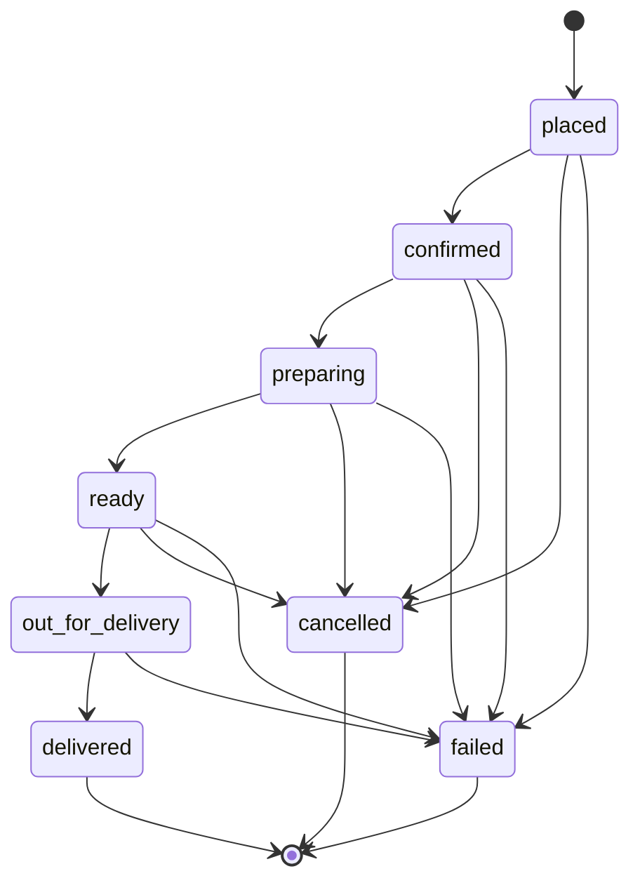

# Order Pipeline

A full-stack implementation for a food-delivery order pipeline.

The system models the lifecycle of food-delivery orders from `placed` through `delivered`, while handling bursty traffic, flaky downstream systems, retries, idempotency, worker failure, and live operational visibility.

## Features

- High-volume order ingestion API
- Order lifecycle state machine
- PostgreSQL-backed source of truth
- Transactional outbox for reliable queue publishing
- Redis Streams worker queue with consumer groups and acknowledgements
- Flaky restaurant and courier simulators
- Retry behavior with bounded attempts
- Live React dashboard using Server-Sent Events
- Searchable and paginated order table
- Load generator for normal traffic and dinner rush
- Chaos controls for degrading/recovering downstream systems
- Health, readiness, and metrics endpoints
- Docker Compose single-machine runtime

## Architecture



## Order lifecycle



## Why this design

- **PostgreSQL is the source of truth** because losing or duplicating orders is more expensive than maximizing raw queue throughput.
- **Redis Streams are used instead of Redis Pub/Sub** because Streams support consumer groups, pending messages, and explicit acknowledgement.
- **The outbox pattern** avoids the failure gap between committing an order to the database and publishing queue work.
- **Workers use guarded state transitions** such as `WHERE id = ? AND status = ?`, so duplicated messages cannot advance an order twice.
- **Idempotency keys** prevent duplicate order creation when a client retries the same request.
- **Server-Sent Events** are used for dashboard updates because the UI mostly needs one-way server-to-browser live updates.
- **Downstream systems are simulated** with configurable latency and failure rates to show realistic retry/recovery behavior.

This implementation does not claim exactly-once message delivery. It uses a more realistic pattern: **at-least-once delivery with idempotent handlers and guarded state transitions**.

## Prerequisites

For the default Docker Compose flow:

- Docker Desktop
- Docker Compose

For running services locally outside Docker:

- Go 1.26+
- Node.js 20+
- npm

Optional preflight check:

```bash
./scripts/bootstrap-local.sh
```

This checks local tool versions and verifies required project files exist.

## Run everything

```bash
docker compose up --build
```

Or run in detached mode:

```bash
docker compose up -d --build
```

Open:

- Dashboard: http://localhost:5173
- API health: http://localhost:8080/health
- API readiness: http://localhost:8080/ready
- Metrics: http://localhost:8080/metrics

Check running containers:

```bash
docker compose ps
```

View logs:

```bash
docker compose logs -f
```

View worker and dispatcher logs specifically:

```bash
docker compose logs -f worker dispatcher
```

Stop everything:

```bash
docker compose down
```

Reset all local data:

```bash
docker compose down -v
```

## Drive load

Small load:

```bash
curl -X POST http://localhost:8080/api/load/start \
  -H "Content-Type: application/json" \
  -d '{"orders_per_second":5,"duration_seconds":30}'
```

Dinner rush:

```bash
curl -X POST http://localhost:8080/api/load/rush
```

CLI load generator:

```bash
go run ./backend/cmd/loadgen --api http://localhost:8080 --rate 50 --duration 60s
```

During load, watch the dashboard for:

- Orders created per minute
- In-flight orders
- Pipeline stage counts
- Delivered orders
- Failed orders
- Retry count
- Pending outbox/backlog indicators

## Search and inspect orders

List the first page of orders:

```bash
curl "http://localhost:8080/api/orders?page=1&page_size=10"
```

Go to the second page:

```bash
curl "http://localhost:8080/api/orders?page=2&page_size=10"
```

Filter by status:

```bash
curl "http://localhost:8080/api/orders?page=1&page_size=10&status=delivered"
```

Search by order id, idempotency key, customer name, restaurant id, status, or failure reason:

```bash
curl "http://localhost:8080/api/orders?page=1&page_size=10&q=delivered"
```

Search and filter together:

```bash
curl "http://localhost:8080/api/orders?page=1&page_size=10&q=restaurant&status=preparing"
```

The dashboard also includes a searchable, paginated order table for operational inspection.

## Trigger downstream failures

Degrade restaurant:

```bash
curl -X POST http://localhost:8080/api/chaos/restaurant \
  -H "Content-Type: application/json" \
  -d '{"failure_rate":0.75,"min_delay_ms":500,"max_delay_ms":2500}'
```

Recover restaurant:

```bash
curl -X POST http://localhost:8080/api/chaos/restaurant \
  -H "Content-Type: application/json" \
  -d '{"failure_rate":0,"min_delay_ms":100,"max_delay_ms":700}'
```

Degrade courier:

```bash
curl -X POST http://localhost:8080/api/chaos/courier \
  -H "Content-Type: application/json" \
  -d '{"failure_rate":0.65,"min_delay_ms":500,"max_delay_ms":3000}'
```

Recover courier:

```bash
curl -X POST http://localhost:8080/api/chaos/courier \
  -H "Content-Type: application/json" \
  -d '{"failure_rate":0,"min_delay_ms":100,"max_delay_ms":800}'
```

Expected behavior during downstream degradation:

- Orders remain in valid lifecycle states.
- Retry counts increase.
- Some orders may eventually move to `failed` after bounded retries.
- The dashboard makes the failure visible.
- After recovery, new and retryable work continues processing.

## Kill and recover a worker

Stop the worker while the system is busy:

```bash
docker compose stop worker
```

Watch the dashboard:

- API continues accepting orders.
- Orders are not lost.
- Backlog/pending work grows.
- Existing order state remains in PostgreSQL.

Restart the worker:

```bash
docker compose start worker
```

Watch processing recover:

- Worker consumes queued messages again.
- Orders continue moving through the lifecycle.
- Guarded state transitions prevent duplicate lifecycle advancement.

## Health and observability

Health check:

```bash
curl http://localhost:8080/health
```

Readiness check:

```bash
curl http://localhost:8080/ready
```

Metrics:

```bash
curl http://localhost:8080/metrics
```

Useful logs:

```bash
docker compose logs -f api
docker compose logs -f dispatcher
docker compose logs -f worker
docker compose logs -f simulator
```

## Useful dev commands

```bash
make up
make down
make logs
make test
make fmt
make rush
```

Backend checks:

```bash
cd backend
go fmt ./...
go test ./...
```

Frontend checks:

```bash
cd frontend
npm install
npm run build
```

## Demo script

1. Start the stack:

   ```bash
   docker compose up --build
   ```

2. Open the dashboard:

   ```text
   http://localhost:5173
   ```

3. Send a small load:

   ```bash
   curl -X POST http://localhost:8080/api/load/start \
     -H "Content-Type: application/json" \
     -d '{"orders_per_second":5,"duration_seconds":30}'
   ```

4. Show normal lifecycle progress:

   ```text
   placed -> confirmed -> preparing -> ready -> out_for_delivery -> delivered
   ```

5. Trigger dinner rush:

   ```bash
   curl -X POST http://localhost:8080/api/load/rush
   ```

6. Show how the system behaves under bursty load:
   - In-flight orders increase.
   - Queue/backlog may increase.
   - Workers continue processing.
   - Dashboard updates without refresh.

7. Degrade the restaurant service:

   ```bash
   curl -X POST http://localhost:8080/api/chaos/restaurant \
     -H "Content-Type: application/json" \
     -d '{"failure_rate":0.75,"min_delay_ms":500,"max_delay_ms":2500}'
   ```

8. Show retries and stuck/failing stages becoming visible.

9. Recover the restaurant service:

   ```bash
   curl -X POST http://localhost:8080/api/chaos/restaurant \
     -H "Content-Type: application/json" \
     -d '{"failure_rate":0,"min_delay_ms":100,"max_delay_ms":700}'
   ```

10. Stop the worker:

    ```bash
    docker compose stop worker
    ```

11. Show that orders are not lost and backlog grows.

12. Restart the worker:

    ```bash
    docker compose start worker
    ```

13. Show processing recovery.

14. Use order search/pagination to inspect a specific order or status:

    ```bash
    curl "http://localhost:8080/api/orders?page=1&page_size=10&status=failed"
    ```

## Main trade-offs

### PostgreSQL as source of truth

This adds more database writes, but it makes correctness easier to reason about. Order status, idempotency, retries, and lifecycle history are durable and inspectable.

### Transactional outbox

The outbox adds an extra table and dispatcher process, but it prevents the failure gap where an order is committed to the database but never published to the queue.

### Redis Streams

Redis Streams are lighter than Kafka or RabbitMQ and easy to run locally. They are a good fit for this demo because they provide consumer groups and acknowledgement without adding too much operational overhead.

### SSE instead of WebSockets

SSE is simpler for this dashboard because updates are mostly server-to-client. WebSockets would be useful if operators needed richer bidirectional workflows.

### At-least-once processing

The system does not depend on exactly-once queue semantics. Workers may receive messages more than once, but database transitions are guarded and idempotent.

### Self-running migrations

Services run database migrations on startup for local demo convenience. A PostgreSQL advisory lock prevents concurrent startup migration races. In production, migrations would normally run as a dedicated release step.

## Current limitations and next improvements

- Redis Streams pending-message claiming is basic. A production version would add stronger abandoned-message recovery with pending inspection and claiming.
- Retry scheduling is intentionally simple and stored in PostgreSQL for clarity. A larger system might use a dedicated delayed queue.
- Metrics are simple JSON-style counters. Production would expose Prometheus metrics and dashboards.
- The simulator is intentionally simple but configurable enough for a live demo.
- The dashboard is operationally useful but could add per-order detail pages, retry history, and latency percentiles.
- There is no authentication or authorization because this is a local demo.
